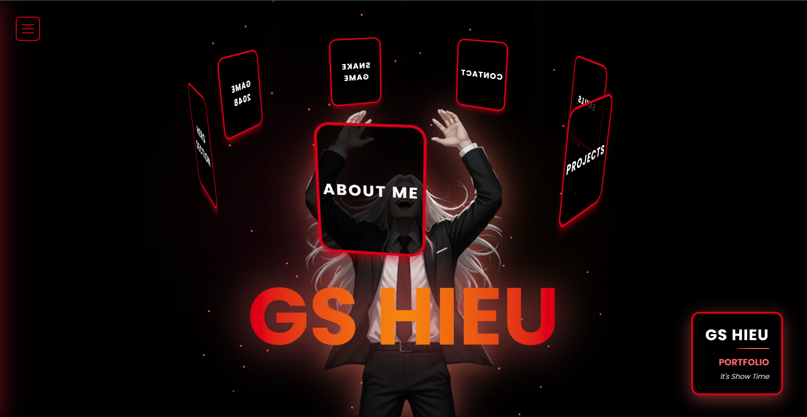

# 3D Portfolio (React + Vite)

## Mô tả

- Dự án: Portfolio tương tác 3D được xây dựng bằng React + Vite.
- Mục tiêu: Dự án này là một trang web portfolio cá nhân được thiết kế nhằm mục đích giới thiệu bản thân một cách chuyên nghiệp và sáng tạo.

## Bắt đầu nhanh

1. Cài đặt

- Sử dụng npm:
  ```bash
  npm install
  ```
- Hoặc yarn:
  ```bash
  yarn
  ```

2. Chạy ở chế độ phát triển

- npm:
  ```bash
  cd 3d_portfolio
  npm run dev
  ```
- yarn:
  ```bash
  cd 3d_portfolio
  yarn dev
  ```

3. Build để triển khai

- npm:
  ```bash
  npm run build
  ```
- yarn:
  ```bash
  yarn build
  ```

4. Xem bản build cục bộ

- npm:
  ```bash
  npm run preview
  ```
- yarn:
  ```bash
  yarn preview
  ```

## Cấu trúc thư mục

- `public/`
- `src/`
  - `assets/`
  - `components/`
  - `pages/`
  - `main.jsx`
  - `App.jsx`

## Các phụ thuộc thường dùng

- `react`, `react-dom`
- `vite`

## Đóng góp

- Fork -> tạo branch -> pull request
- Mô tả rõ thay đổi và ảnh chụp/recording nếu là thay đổi giao diện 3D.

## Hình ảnh (Screenshots)

```markdown

```
